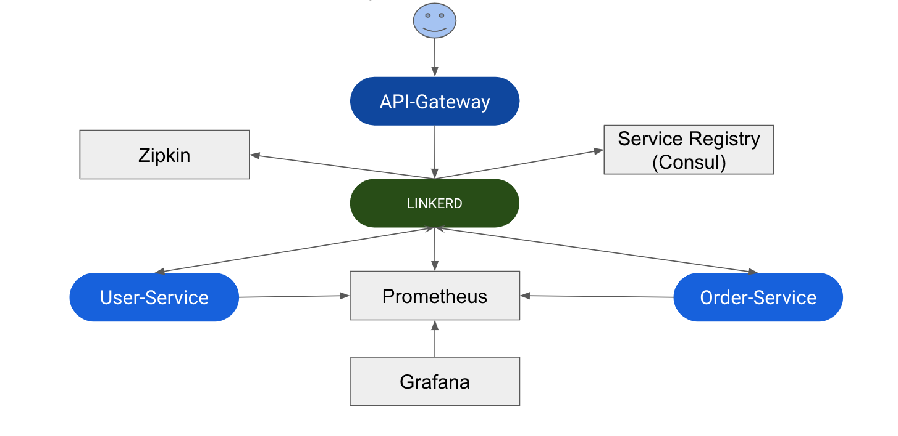

This project demonstrate how to leverage [Service Mesh](https://linkerd.io/1/getting-started/docker/) Layer in Microservice Architecture.  

Up and run:
1. `./gradlew clean jibDockerBuild` (build docker images locally) or `./gradlew clean jib` (build and push docker images to configured $dockerRepository)
2. `cd docker && docker-compose up -d --scale order-service=2 --scale user-service=2` (up and run docker containers with all the business and technical services).
3. `curl http://localhost:8070/order-service/orders`. Data-flow: api-gateway -> linkerd -> order-service -> linkerd -> user-service.

Project Architecture

Service Mesh Demo [Presentation](doc/Service-Mesh-Presentation.pdf)

Notes:  
Desired name of the dockerRepository should be configured in `gradle.properties`.

Tags:  
Example of Microservice Architecture with Spring Boot, Microservice Architecture with Service Mesh, Service Mesh example Java Kotlin, Service Mesh POC, Linkerd example Java, Linkerd Docker example